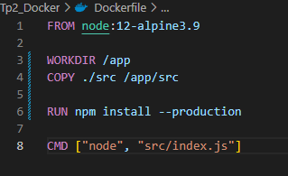
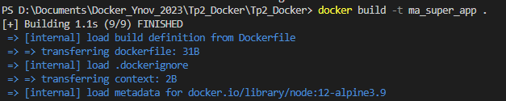
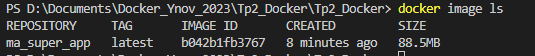
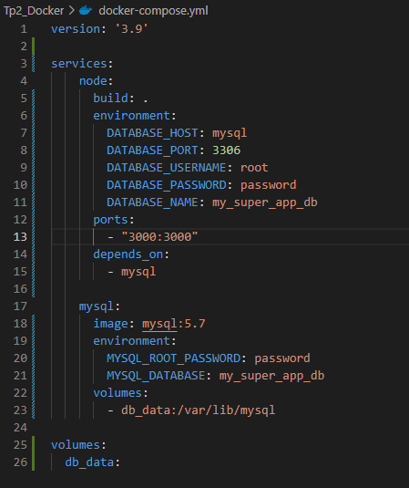
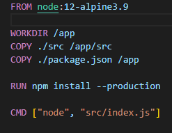
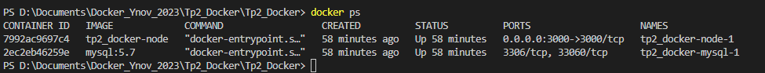
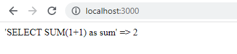

# TP2 Docker 

## Author

- [@Enzo Pistre](https://github.com/DaoGod)
- [@Nicolas Seillé](https://github.com/Nicolas-3050)

## 2. Début du TP
Compléter le Dockerfile afin de builder correctement l’application contenu dans src/

### a. L'option de npm qui permet d'installer que ce qui est nécessaire 
L'option de npm pour installer uniquement les dépendances nécessaires est --production (donc la commande npm install --production). Cela installe uniquement les dépendances requises pour exécuter l'application, et exclut les dépendances dont on ne se sert pas.

C'est une bonne pratique Docker car on réduit la taille de l'image et donc on optimise les performances. Cela permet aussi d'améliorer la sécurité en éliminant les vulnérabilités potentielles introduites par les dépendances dont on ne se sert pas.

## 3. Créer l'image ma_super_app avec docker build

On Build ensuite l'image avec la commande :
docker build -t ma_super_app .

Où ma_super_app est le nom donné à l'image que l'on veut créer et . parce que le Dockerfile se situe dans le répertoire courant. 

## 4. Compléter le fichier docker-compose.yml afin d’éxécuter ma_super_app avec sa base de données

Le service node sert à exécuter l'application node.js. Les variables d'environement DATABASE_HOST, DATABASE_PORT, DATABASE_USERNAME, DATABASE_PASSWORD et DATABASE_NAME ont été renseignées.
Dans le service node, build indique que l'image de l'application doit être construite à partir du Dockerfile. Le "." veut dire que le Dockerfile est dans le répertoire courant.
depends_on sert à spécifier que le service node dépend du service mysql.

Le service mysql sert à exécuter la base de donnée MySQL. Je l'ai configuré avec les variables d'environement MYSQL_ROOT_PASSWORD et MYSQL_DATABASE

J'ai utilisé une image mysql:5.7 et pas la dernière car dans les versions plus récentes, le client mysql ne prends pas en charge le même mode d'authentification que celui demandé par le serveur, ici "mysql_native_password".

J'ai rajouté le fichier "package.json" en copy dans le dockerfile pour que le module express soit installé.

La commande docker ps nous permet de vérifier que les containers node et mysql ont bien été créés

Pour s'assurer que l'application my_super_app fonctionne bien, il faut vérifier que le fichier index.js exécute bien la requête SQL qui permet d'additionner deux nombres de la base de données mysql et nous envoie le résultat, en faisant la requête http : "http://localhost:3000/". Le résultat de la requête doit s'afficher sur le navigateur. 

